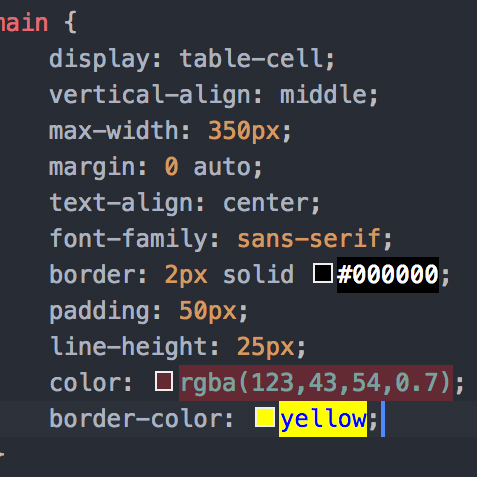

# Pigments for VSCode

[Rate this on vscode marketplace](https://marketplace.visualstudio.com/items?itemName=jaspernorth.vscode-pigments) | [View on github](https://github.com/DeMoorJasper/vscode-pigments)

Add instant Snazzy looking color previews to vscode.

